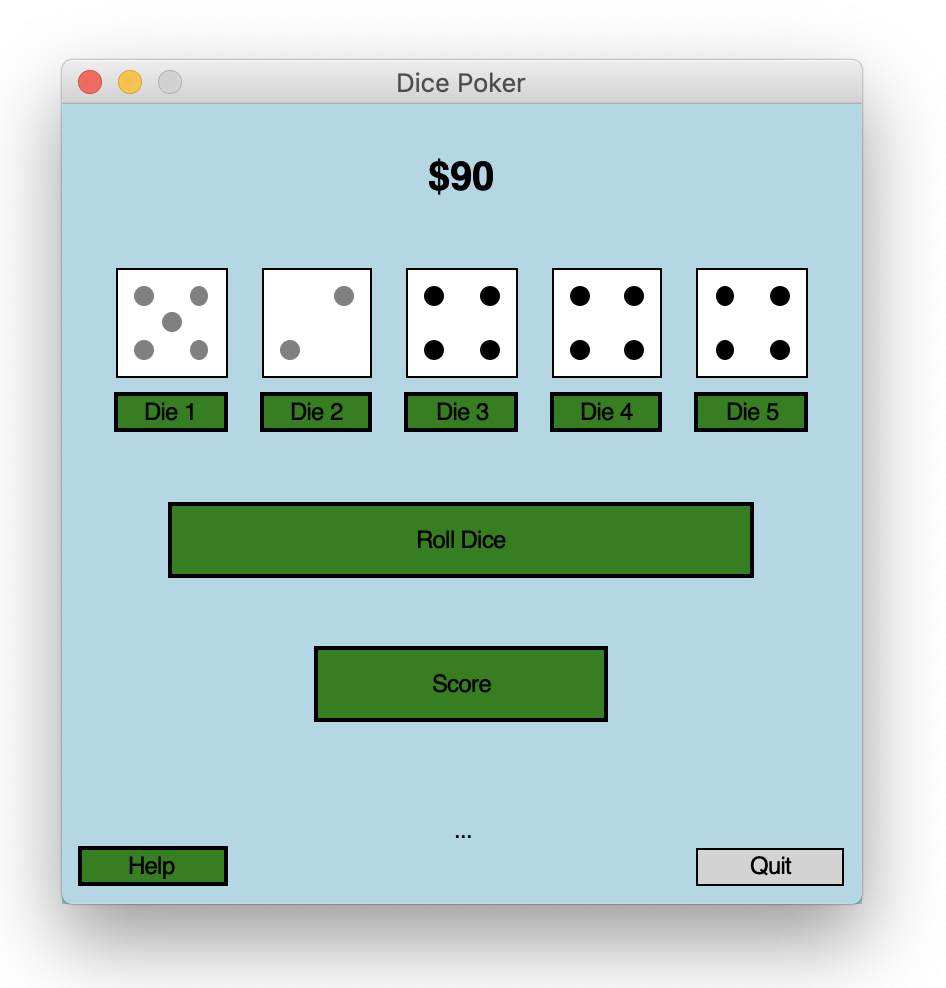
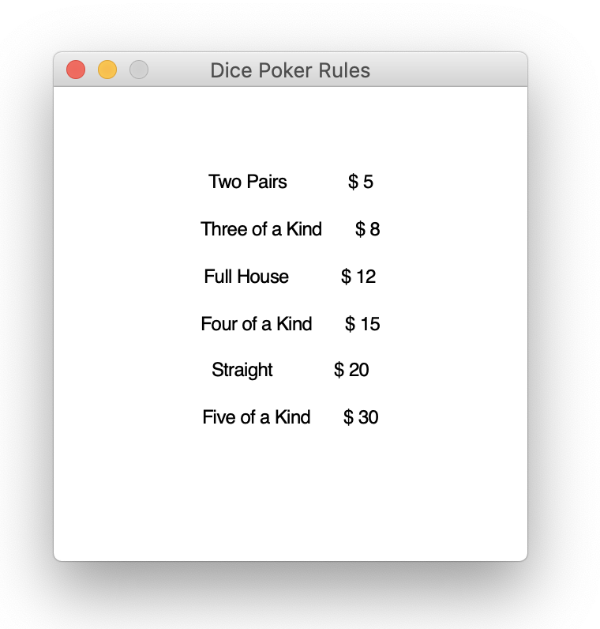

# Dice Poker built with Python and graphics.py

## graphics.py:
Is a simple object oriented graphics library designed to make it very easy for novice programmers to experiment with computer graphics in an object oriented fashion. It is written by John Zelle for use with the book "Python Programming: An Introduction to Computer Science" (Franklin, Beedle & Associates).

## LICENSE:
This is open-source software released under the terms of the
GPL (http://www.gnu.org/licenses/gpl.html).

## PLATFORMS: 
The package is a wrapper around Tkinter and should run on
any platform where Tkinter is available.

## INSTALLATION: 
Put the graphics.py file somewhere where Python can see it.

## Video: 

## Images: 

